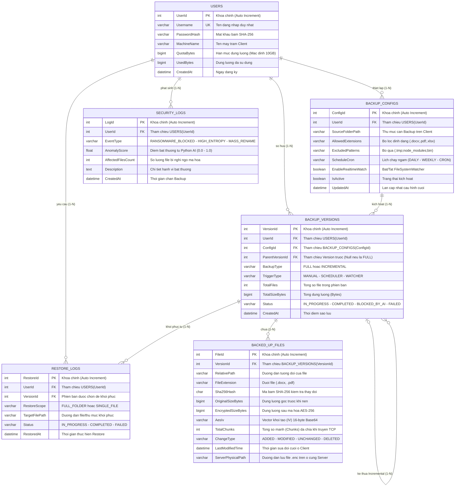

# Database ERD

```mermaid
erDiagram
    USERS ||--o{ BACKUP_CONFIGS : "thiet lap (1-N)"
    USERS ||--o{ BACKUP_VERSIONS : "so huu (1-N)"
    USERS ||--o{ RESTORE_LOGS : "yeu cau (1-N)"
    USERS ||--o{ SECURITY_LOGS : "phat sinh (1-N)"

    BACKUP_CONFIGS ||--o{ BACKUP_VERSIONS : "kich hoat (1-N)"
    BACKUP_VERSIONS |o--o{ BACKUP_VERSIONS : "ke thua Incremental (1-N)"
    BACKUP_VERSIONS ||--o{ BACKED_UP_FILES : "chua (1-N)"
    BACKUP_VERSIONS ||--o{ RESTORE_LOGS : "khoi phuc tu (1-N)"

    USERS {
        int UserId PK "Khoa chinh (Auto Increment)"
        varchar Username UK "Ten dang nhap duy nhat"
        varchar PasswordHash "Mat khau bam SHA-256"
        varchar MachineName "Ten may tram Client"
        bigint QuotaBytes "Han muc dung luong (Mac dinh 10GB)"
        bigint UsedBytes "Dung luong da su dung"
        datetime CreatedAt "Ngay dang ky"
    }

    BACKUP_CONFIGS {
        int ConfigId PK "Khoa chinh (Auto Increment)"
        int UserId FK "Tham chieu USERS(UserId)"
        varchar SourceFolderPath "Thu muc can Backup tren Client"
        varchar AllowedExtensions "Bo loc dinh dang (.docx;.pdf;.xlsx)"
        varchar ExcludedPatterns "Bo qua (.tmp;node_modules;bin)"
        varchar ScheduleCron "Lich chay ngam (DAILY - WEEKLY - CRON)"
        boolean EnableRealtimeWatch "Bat/Tat FileSystemWatcher"
        boolean IsActive "Trang thai kich hoat"
        datetime UpdatedAt "Lan cap nhat cau hinh cuoi"
    }

    BACKUP_VERSIONS {
        int VersionId PK "Khoa chinh (Auto Increment)"
        int UserId FK "Tham chieu USERS(UserId)"
        int ConfigId FK "Tham chieu BACKUP_CONFIGS(ConfigId)"
        int ParentVersionId FK "Tham chieu Version truoc (Null neu la FULL)"
        varchar BackupType "FULL hoac INCREMENTAL"
        varchar TriggerType "MANUAL - SCHEDULER - WATCHER"
        int TotalFiles "Tong so file trong phien ban"
        bigint TotalSizeBytes "Tong dung luong (Bytes)"
        varchar Status "IN_PROGRESS - COMPLETED - BLOCKED_BY_AI - FAILED"
        datetime CreatedAt "Thoi diem sao luu"
    }

    BACKED_UP_FILES {
        int FileId PK "Khoa chinh (Auto Increment)"
        int VersionId FK "Tham chieu BACKUP_VERSIONS(VersionId)"
        varchar RelativePath "Duong dan tuong doi cua file"
        varchar FileExtension "Duoi file (.docx, .pdf)"
        char Sha256Hash "Ma bam SHA-256 kiem tra thay doi"
        bigint OriginalSizeBytes "Dung luong goc truoc khi nen"
        bigint EncryptedSizeBytes "Dung luong sau ma hoa AES-256"
        varchar AesIv "Vector khoi tao (IV) 16-byte Base64"
        int TotalChunks "Tong so manh (Chunks) da chia khi truyen TCP"
        varchar ChangeType "ADDED - MODIFIED - UNCHANGED - DELETED"
        datetime LastModifiedTime "Thoi gian sua doi cuoi o Client"
        varchar ServerPhysicalPath "Duong dan luu file .enc tren o cung Server"
    }

    RESTORE_LOGS {
        int RestoreId PK "Khoa chinh (Auto Increment)"
        int UserId FK "Tham chieu USERS(UserId)"
        int VersionId FK "Phien ban duoc chon de khoi phuc"
        varchar RestoreScope "FULL_FOLDER hoac SINGLE_FILE"
        varchar TargetFilePath "Duong dan file/thu muc khoi phuc"
        varchar Status "IN_PROGRESS - COMPLETED - FAILED"
        datetime RestoredAt "Thoi gian thuc hien Restore"
    }

    SECURITY_LOGS {
        int LogId PK "Khoa chinh (Auto Increment)"
        int UserId FK "Tham chieu USERS(UserId)"
        varchar EventType "RANSOMWARE_BLOCKED - HIGH_ENTROPY - MASS_RENAME"
        float AnomalyScore "Diem bat thuong tu Python AI (0.0 - 1.0)"
        int AffectedFilesCount "So luong file bi nghi ngo ma hoa"
        text Description "Chi tiet hanh vi bat thuong"
        datetime CreatedAt "Thoi gian chan Backup"
    }
```
