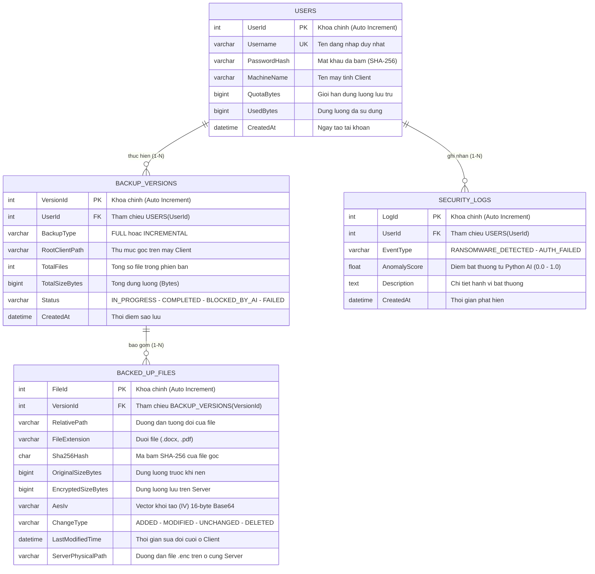

# Database ERD

```mermaid
erDiagram
    USERS ||--o{ BACKUP_VERSIONS : "thuc hien (1-N)"
    USERS ||--o{ SECURITY_LOGS : "ghi nhan (1-N)"
    BACKUP_VERSIONS ||--o{ BACKED_UP_FILES : "bao gom (1-N)"

    USERS {
        int UserId PK "Khoa chinh (Auto Increment)"
        varchar Username UK "Ten dang nhap duy nhat"
        varchar PasswordHash "Mat khau da bam (SHA-256)"
        varchar MachineName "Ten may tinh Client"
        bigint QuotaBytes "Gioi han dung luong luu tru"
        bigint UsedBytes "Dung luong da su dung"
        datetime CreatedAt "Ngay tao tai khoan"
    }

    BACKUP_VERSIONS {
        int VersionId PK "Khoa chinh (Auto Increment)"
        int UserId FK "Tham chieu USERS(UserId)"
        varchar BackupType "FULL hoac INCREMENTAL"
        varchar RootClientPath "Thu muc goc tren may Client"
        int TotalFiles "Tong so file trong phien ban"
        bigint TotalSizeBytes "Tong dung luong (Bytes)"
        varchar Status "IN_PROGRESS - COMPLETED - BLOCKED_BY_AI - FAILED"
        datetime CreatedAt "Thoi diem sao luu"
    }

    BACKED_UP_FILES {
        int FileId PK "Khoa chinh (Auto Increment)"
        int VersionId FK "Tham chieu BACKUP_VERSIONS(VersionId)"
        varchar RelativePath "Duong dan tuong doi cua file"
        varchar FileExtension "Duoi file (.docx, .pdf)"
        char Sha256Hash "Ma bam SHA-256 cua file goc"
        bigint OriginalSizeBytes "Dung luong truoc khi nen"
        bigint EncryptedSizeBytes "Dung luong luu tren Server"
        varchar AesIv "Vector khoi tao (IV) 16-byte Base64"
        varchar ChangeType "ADDED - MODIFIED - UNCHANGED - DELETED"
        datetime LastModifiedTime "Thoi gian sua doi cuoi o Client"
        varchar ServerPhysicalPath "Duong dan file .enc tren o cung Server"
    }

    SECURITY_LOGS {
        int LogId PK "Khoa chinh (Auto Increment)"
        int UserId FK "Tham chieu USERS(UserId)"
        varchar EventType "RANSOMWARE_DETECTED - AUTH_FAILED"
        float AnomalyScore "Diem bat thuong tu Python AI (0.0 - 1.0)"
        text Description "Chi tiet hanh vi bat thuong"
        datetime CreatedAt "Thoi gian phat hien"
    }
```
